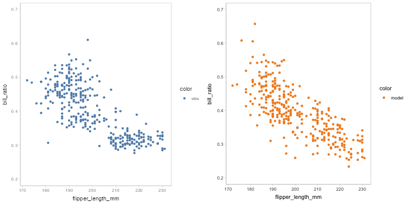
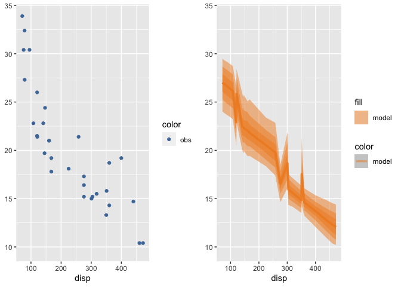
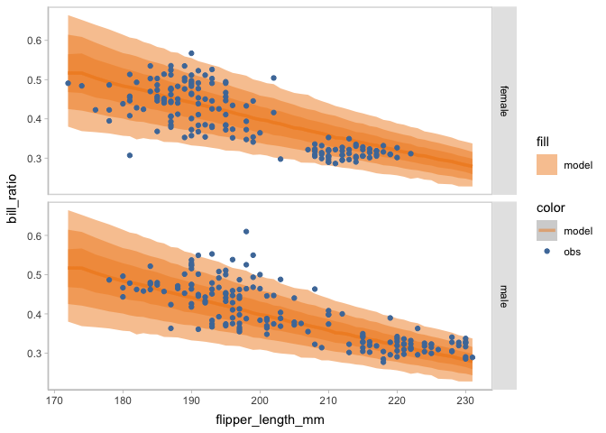
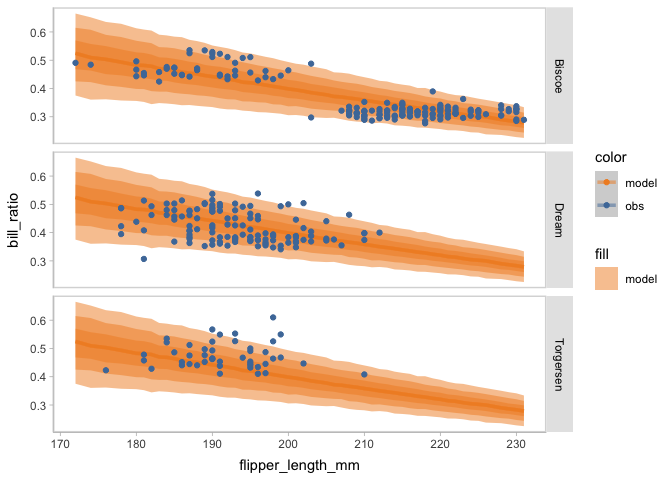
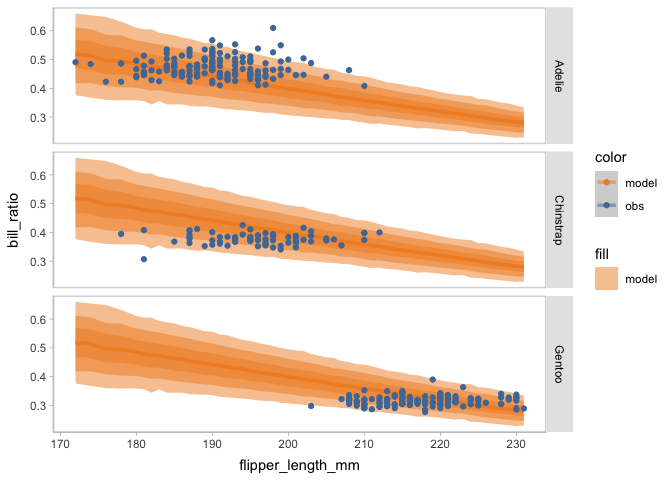
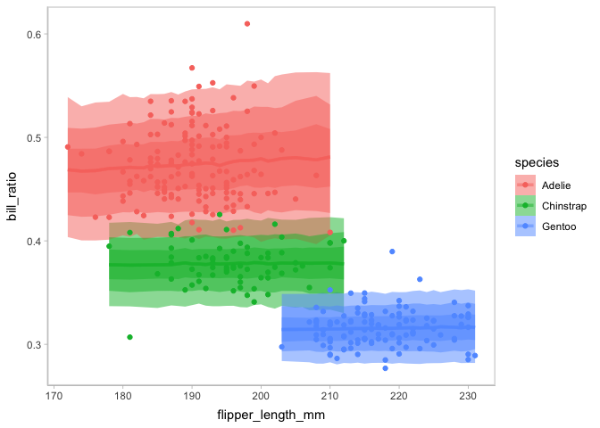
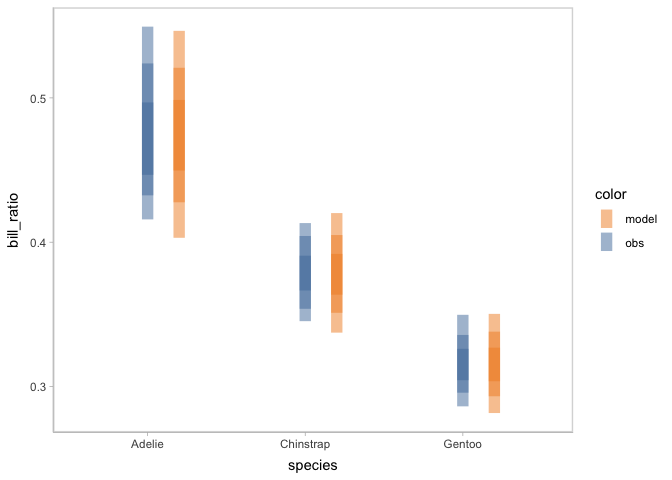
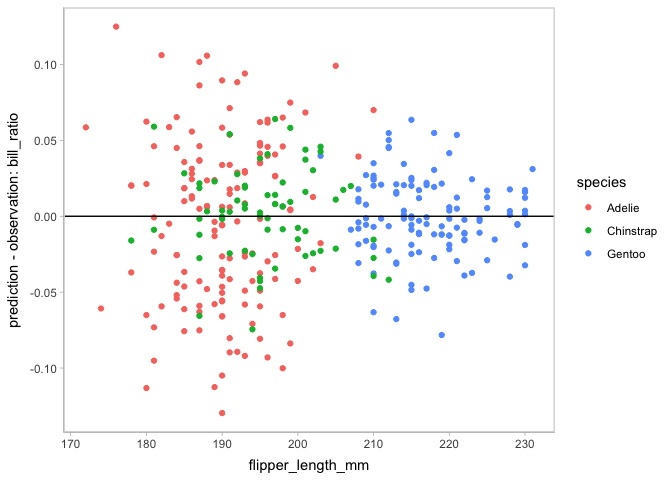
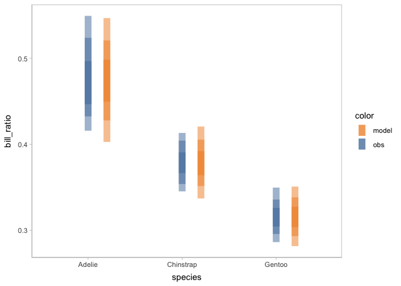

<!-- README.md is generated from README.Rmd. Please edit that file -->

# VMC: An R package for generating model check visualizations

<!-- badges: start -->
<!-- badges: end -->

`vmc` is a visualization grammar designed to make it easy to generate
informative visualizations for model checking. The `vmc` grammar assumes
a basic workflow for creating model checks. First, the model predictions
or model features need to be extracted as a **distribution** of data
from a model object, i.e. data tidying. Then the user must specify an
**uncertainty representation** to describe the selected distribution(s).
They must also specify the presentation of the observed data. The user
can choose among multiple **comparative layouts** to structure their
comparison between observed data and model predictions.

## Installation

You can install the development version of vmc from
[GitHub](https://github.com/) with:

``` r
# install.packages("devtools")
devtools::install_github("MUCollective/vmc")
```

## Usage

### Set up

``` r
library(vmc)
library(ggplot2)
library(dplyr)
library(palmerpenguins)
library(brms)
library(ggdist)
library(tidybayes)
library(cowplot)
library(tidyr)
library(gganimate)

theme_set(theme_tidybayes() + panel_border())
```

### Model

First, we fit a beta regression model to predict the penguins’ bill
ratio (i.e., bill depth / bill length) based on penguins’ flipper
length.

``` r
penguins <- penguins %>%
  drop_na(sex) %>%
  mutate(is_gentoo = species == "Gentoo") %>%
  mutate(bill_ratio = bill_depth_mm / bill_length_mm)
```

``` r
model_beta <- brm(
  bf(bill_ratio ~ flipper_length_mm,
     phi ~ flipper_length_mm),
  family = Beta(),
  init = "0",
  data = penguins,
  prior = c(prior(normal(0, 1), class = "b"),
            prior(exponential(1), class = "b", dpar = "phi", lb = 0)),
  file = "models/model.rds"
)
```

The results…

``` r
model_beta
#>  Family: beta 
#>   Links: mu = logit; phi = log 
#> Formula: bill_ratio ~ flipper_length_mm 
#>          phi ~ flipper_length_mm
#>    Data: penguins (Number of observations: 333) 
#>   Draws: 4 chains, each with iter = 2000; warmup = 1000; thin = 1;
#>          total post-warmup draws = 4000
#> 
#> Population-Level Effects: 
#>                       Estimate Est.Error l-95% CI u-95% CI Rhat Bulk_ESS
#> Intercept                 3.06      0.16     2.75     3.37 1.00     4082
#> phi_Intercept            -1.35      1.30    -3.93     1.22 1.00     1844
#> flipper_length_mm        -0.02      0.00    -0.02    -0.02 1.00     4210
#> phi_flipper_length_mm     0.03      0.01     0.02     0.04 1.00     1854
#>                       Tail_ESS
#> Intercept                 2918
#> phi_Intercept             1479
#> flipper_length_mm         2768
#> phi_flipper_length_mm     1625
#> 
#> Draws were sampled using sampling(NUTS). For each parameter, Bulk_ESS
#> and Tail_ESS are effective sample size measures, and Rhat is the potential
#> scale reduction factor on split chains (at convergence, Rhat = 1).
```

### Check on the shape of distrition

You can start model checking by check the shape of the distribution of
predicted bill ratio and observed bill ratio. Using `vmc`, you can
create a posterior predictive check by only one `mcplot()` (and also
using `coord_flip()` to flip the response variable to the x-axis).

``` r
model_beta %>%
  mcplot() +
  mc_gglayer(coord_flip())
```


You can not only check on the shape of posterior predictive
distribution, but also check on other posterior distributions generated
by `model_beta` using the `mc_distribution` component. For example,
there are two parameter `mu` and `phi` besides the response variable in
the beta regression model we are using. Here, we are check on the
posterior distribution of `mu`.

``` r
model_beta %>%
  mcplot() +
  mc_distribution("mu") +
  mc_observation_transformation(mean, group = vars(flipper_length_mm)) +
  mc_gglayer(coord_flip())
```


### Check on the marginal effects

You may find the misalignment between the shape of predictive
distribution and observed distribution. You can scrutinize the
misalignment further by checking on the marginal effects of the
predictor using `mc_condition_on`.

``` r
model_beta %>%
  mcplot() +
  mc_distribution(ndraws = 1) +
  mc_condition_on(x = vars(flipper_length_mm))
```


To reveal the uncertainty information inside of the model predictions,
you can use either HOPs or other uncertainty representations.

`vmc` supports HOPs as a method to group samples (see
`vignette("uncertainty-representation")`).

``` r
model_beta %>%
  mcplot() +
  mc_distribution(ndraws = 50) +
  mc_model_point(group_sample = "hops") +
  mc_condition_on(x = vars(flipper_length_mm))
#> nframes and fps adjusted to match transition
```

You may find that some of the points of model predictions and observed
data are overlapped together, which may cause visual clutter. To fix
this problem, you can change to another comparative layout using
`mc_layout_*`.

``` r
model_beta %>%
  mcplot() +
  mc_distribution(ndraws = 50) +
  mc_model_point(group_sample = "hops") +
  mc_condition_on(x = vars(flipper_length_mm)) +
  mc_layout_juxtaposition()
#> nframes and fps adjusted to match transition
#> # A tibble: 50 × 7
#>    format width height colorspace matte filesize density
#>    <chr>  <int>  <int> <chr>      <lgl>    <int> <chr>  
#>  1 gif      800    400 sRGB       FALSE        0 28x28  
#>  2 gif      800    400 sRGB       FALSE        0 28x28  
#>  3 gif      800    400 sRGB       FALSE        0 28x28  
#>  4 gif      800    400 sRGB       FALSE        0 28x28  
#>  5 gif      800    400 sRGB       FALSE        0 28x28  
#>  6 gif      800    400 sRGB       FALSE        0 28x28  
#>  7 gif      800    400 sRGB       FALSE        0 28x28  
#>  8 gif      800    400 sRGB       FALSE        0 28x28  
#>  9 gif      800    400 sRGB       FALSE        0 28x28  
#> 10 gif      800    400 sRGB       FALSE        0 28x28  
#> # ℹ 40 more rows
```



Other uncertainty representations are supported by the visual
representation components (`mc_model_*` and `mc_obs_*`).

``` r
model_beta %>%
  mcplot() +
  mc_distribution(ndraws = 1000) +
  mc_model_lineribbon() +
  mc_condition_on(x = vars(flipper_length_mm))
```



### Facet to find the source of multimodal

You may find there seem to be some clusters among the points of observed
bill ratio. To find the source of this multimodal, you can change the
conditional variable to facet the model checking on rows or columns
using `mc_condition_on`.

``` r
model_beta %>%
  mcplot(observation = penguins) +
  mc_distribution(ndraws = 1000) +
  mc_model_lineribbon() +
  mc_condition_on(x = vars(flipper_length_mm),
                  row = vars(sex))
```



``` r
model_beta %>%
  mcplot(observation = penguins) +
  mc_distribution(ndraws = 1000) +
  mc_model_lineribbon() +
  mc_condition_on(x = vars(flipper_length_mm),
                  row = vars(island))
```



``` r
model_beta %>%
  mcplot(observation = penguins) +
  mc_distribution(ndraws = 1000) +
  mc_model_lineribbon() +
  mc_condition_on(x = vars(flipper_length_mm),
                  row = vars(species))
```



### New model

When faceting on the species of penguins, you can see the points of
observed bill ratio are clustered into three groups. This finding can
inform an update on the model to include species as an independent
variable.

``` r
model_species <- brm(
  bf(bill_ratio ~ flipper_length_mm * species,
     phi ~ flipper_length_mm * species),
  family = Beta(),
  init = "0",
  data = penguins,
  prior = c(prior(normal(0, 0.5), class = "b"),
            prior(normal(0, 0.15), class = "b", dpar = "phi")),
  cores = 4,
  iter = 24000,
  warmup = 14000,
  
  file = "models/model_species.rds"
)
```

The result…

``` r
model_species
#>  Family: beta 
#>   Links: mu = logit; phi = log 
#> Formula: bill_ratio ~ flipper_length_mm * species 
#>          phi ~ flipper_length_mm * species
#>    Data: penguins (Number of observations: 333) 
#>   Draws: 4 chains, each with iter = 24000; warmup = 14000; thin = 1;
#>          total post-warmup draws = 40000
#> 
#> Population-Level Effects: 
#>                                        Estimate Est.Error l-95% CI u-95% CI
#> Intercept                                 -0.40      0.26    -0.91     0.12
#> phi_Intercept                              7.76      2.29     3.25    12.24
#> flipper_length_mm                          0.00      0.00    -0.00     0.00
#> speciesChinstrap                          -0.13      0.32    -0.76     0.50
#> speciesGentoo                             -0.45      0.31    -1.05     0.15
#> flipper_length_mm:speciesChinstrap        -0.00      0.00    -0.00     0.00
#> flipper_length_mm:speciesGentoo           -0.00      0.00    -0.00     0.00
#> phi_flipper_length_mm                     -0.01      0.01    -0.04     0.01
#> phi_speciesChinstrap                      -0.01      0.15    -0.31     0.28
#> phi_speciesGentoo                          0.00      0.15    -0.29     0.30
#> phi_flipper_length_mm:speciesChinstrap     0.01      0.00     0.00     0.01
#> phi_flipper_length_mm:speciesGentoo        0.01      0.00     0.00     0.01
#>                                        Rhat Bulk_ESS Tail_ESS
#> Intercept                              1.00    21184    25569
#> phi_Intercept                          1.00    30353    28724
#> flipper_length_mm                      1.00    21186    25744
#> speciesChinstrap                       1.00    21067    24050
#> speciesGentoo                          1.00    21687    24792
#> flipper_length_mm:speciesChinstrap     1.00    20879    23602
#> flipper_length_mm:speciesGentoo        1.00    20853    23819
#> phi_flipper_length_mm                  1.00    30039    28653
#> phi_speciesChinstrap                   1.00    35917    28882
#> phi_speciesGentoo                      1.00    36834    27541
#> phi_flipper_length_mm:speciesChinstrap 1.00    38256    30833
#> phi_flipper_length_mm:speciesGentoo    1.00    27289    27179
#> 
#> Draws were sampled using sampling(NUTS). For each parameter, Bulk_ESS
#> and Tail_ESS are effective sample size measures, and Rhat is the potential
#> scale reduction factor on split chains (at convergence, Rhat = 1).
```

You can check on this new model on the marginal effects of flipper
length and species in one plot by using `mc_condition_on`.

``` r
model_species %>%
  mcplot() +
  mc_distribution(ndraws = 1000) +
  mc_model_lineribbon() +
  mc_condition_on(x = vars(flipper_length_mm),
                  color = vars(species))
```



By this model checking, the new model is validated to capture the
multimodal in the observed data. Then you can check more on the
posterior distribution of the model conditioned on species using `vmc`.

``` r
model_species %>%
  mcplot() +
  mc_model_slab(side = "left") +
  mc_obs_dots() +
  mc_condition_on(x = vars(species))
```


### Check on model assumptions

To check on some particular assumptions of the model, you can pick
different mark types of the visual representation. For example, to check
the calibration of the model, you can choose to use intervals to
represent the model distribution.

``` r
model_species %>%
  mcplot() +
  mc_model_interval() +
  mc_obs_interval() +
  mc_condition_on(x = vars(species)) +
  mc_layout_nested()
```



`vmc` also supports to check on other assumptions, like
heteroskedasticity and the normality of residuals.

``` r
model_species %>%
  mcplot() +
  mc_distribution(ndraws = 1) +
  mc_condition_on(x = vars(flipper_length_mm),
                  color = vars(species)) +
  mc_layout_encoding("residual") +
  mc_gglayer(geom_hline(yintercept = 0))
```



``` r
model_species %>%
  mcplot() +
  mc_distribution(ndraws = 1) +
  mc_condition_on(color = vars(species)) +
  mc_layout_encoding("qq") +
  mc_gglayer(geom_abline())
```


