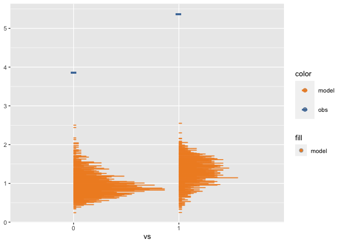

<!-- README.md is generated from README.Rmd. Please edit that file -->

# Modelcheck: An R package for generating model check visualizations

<!-- badges: start -->
<!-- badges: end -->

`modelcheck` is a visualization grammar designed to make it easy to
generate informative visualizations for model checking. The `modelcheck`
grammar assumes a basic workflow for creating model checks. First, the
model predictions or model features need to be extracted as a
**distribution** of data from a model object, i.e. data tidying. Then
the user must specify an **uncertainty representation** to describe the
selected distribution(s). They must also specify the presentation of the
observed data. The user can choose among multiple **comparative
layouts** to structure their comparison between observed data and model
predictions.

## Installation

You can install the development version of modelcheck from
[GitHub](https://github.com/) with:

``` r
# install.packages("devtools")
devtools::install_github("MUCollective/modelcheck")
```

## Usage

### Background: model

We use a simple model to show the usage of `modelcheck`.

``` r
library(brms)
#> Loading required package: Rcpp
#> Loading 'brms' package (version 2.19.0). Useful instructions
#> can be found by typing help('brms'). A more detailed introduction
#> to the package is available through vignette('brms_overview').
#> 
#> Attaching package: 'brms'
#> The following object is masked from 'package:stats':
#> 
#>     ar
model = brm(
  bf(mpg ~ disp + vs + am,
     sigma ~ vs + am),
  init = "0",
  data = mtcars,
  iter = 6000,
  
  file = "models/example_model.rds" # cache model (can be removed)  
)
```

The results…

``` r
model
#>  Family: gaussian 
#>   Links: mu = identity; sigma = log 
#> Formula: mpg ~ disp + vs + am 
#>          sigma ~ vs + am
#>    Data: mtcars (Number of observations: 32) 
#>   Draws: 4 chains, each with iter = 6000; warmup = 3000; thin = 1;
#>          total post-warmup draws = 12000
#> 
#> Population-Level Effects: 
#>                 Estimate Est.Error l-95% CI u-95% CI Rhat Bulk_ESS Tail_ESS
#> Intercept          23.25      2.87    17.57    28.92 1.00     6198     6420
#> sigma_Intercept     0.87      0.20     0.50     1.30 1.00    10336     7471
#> disp               -0.02      0.01    -0.04    -0.01 1.00     6404     6672
#> vs                  2.74      1.74    -0.73     6.14 1.00     6770     6991
#> am                  2.74      1.81    -0.76     6.36 1.00     6100     7119
#> sigma_vs            0.27      0.34    -0.38     0.95 1.00     6544     7801
#> sigma_am            0.34      0.36    -0.38     1.03 1.00     6925     7174
#> 
#> Draws were sampled using sampling(NUTS). For each parameter, Bulk_ESS
#> and Tail_ESS are effective sample size measures, and Rhat is the potential
#> scale reduction factor on split chains (at convergence, Rhat = 1).
```

### Examples

You can create a default model check to do a posterior predictive check
by using `mcplot()` (using `coord_flip()` to flip the response variable
to the x-axis).

``` r
library(modelcheck)
library(ggplot2)
library(dplyr)
#> 
#> Attaching package: 'dplyr'
#> The following objects are masked from 'package:stats':
#> 
#>     filter, lag
#> The following objects are masked from 'package:base':
#> 
#>     intersect, setdiff, setequal, union
model %>%
  mcplot() +
  mc_gglayer(coord_flip())
```


To control how the distribution is drawn from model, you can add a
`mc_distribution()` to `mcplot()`. For example, there are two push
forward transformations `mu` and `sigma` besides the predictive
distribution in the Gaussian example model we are using. Here, we are
drawing the posterior distribution of `mu` from the Gaussian model.

``` r
model %>%
  mcplot() +
  mc_distribution("mu") +
  mc_gglayer(coord_flip())
```


To add marginal effects check, you can use `mc_condition_on()` to add an
x-axis, row grid, and column grid.

``` r
model %>%
  mcplot() +
  mc_distribution("mu") +
  mc_condition_on(x = vars(disp))
```


Or you can check the distribution of `sigma` in the model by specifying
`mc_distribution("sigma")`. You may find, however, that the unit of
observed data misaligned with the `sigma` distribution. You can add
`observation_transform` to `mcplot()` to transform the observed data to
a comparable unit to `sigma`.

``` r
sd_function = function(df) {df %>% group_by(vs) %>% mutate(observation = sd(observation))}

model %>%
  mcplot(observation_transform = sd_function) +
  mc_distribution("sigma") +
  mc_condition_on(x = vars(vs))
```


For the model checks that have a continuous conditional variable,
`modelcheck` implements uncertainty representations, e.g., line + ribbon
plot and point + interval plot, that encode the uncertainty in the model
and also reveal the trend of response variable over the conditional
variable. For those model checks that have no conditional variable or
have a discrete conditional variable, `modelcheck` implements a group of
uncertainty representations, e.g., dots plot, eye plot, and gradient
plot, that show the distribution of the model.

You can use `mc_model_lineribbon()` to use line + ribbon plot to check
the trend of `mpg` with uncertainty encoded by ribbon.

``` r
model %>%
  mcplot() +
  mc_distribution("mu") +
  mc_condition_on(x = vars(disp)) +
  mc_model_lineribbon()
```

 If
conditional on a discrete variable, you can use `mc_model_dots`.

``` r
model %>%
  mcplot(observation_transform = sd_function) +
  mc_distribution("sigma") +
  mc_model_dots() +
  mc_condition_on(x = vars(vs))
```



`mcplot()` puts the model predictions and data observations superposed
by default. You can change that by using `mc_layout_*()`. Here we change
the comparative layout into juxtaposition.

``` r
model %>%
  mcplot() +
  mc_distribution("mu", ndraws = 500) +
  mc_condition_on(x = vars(disp)) +
  mc_model_lineribbon() +
  mc_layout_juxtaposition()
#> Warning: Removed 17 rows containing missing values (`stat_slabinterval()`).
```


