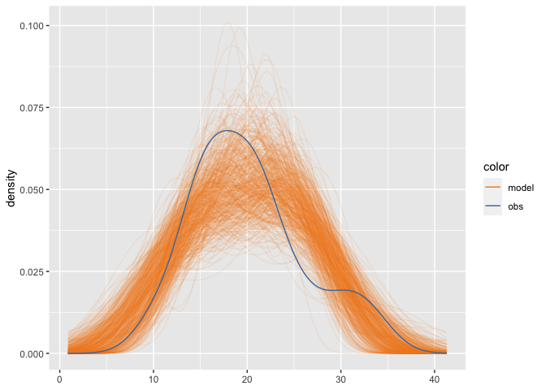
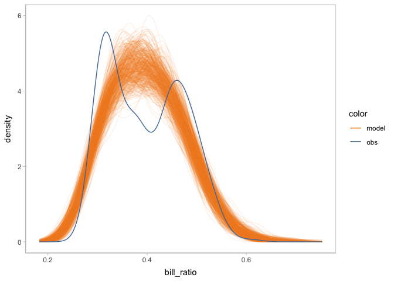
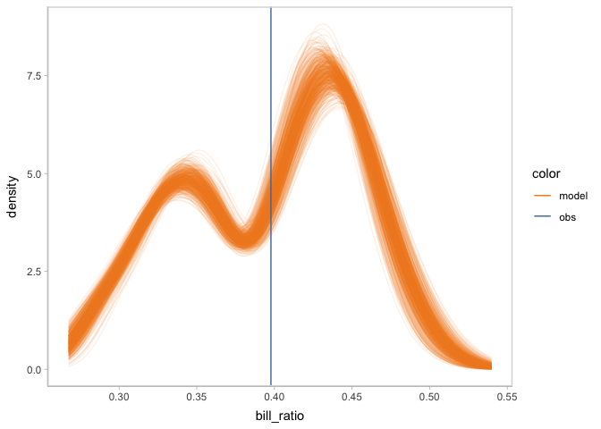
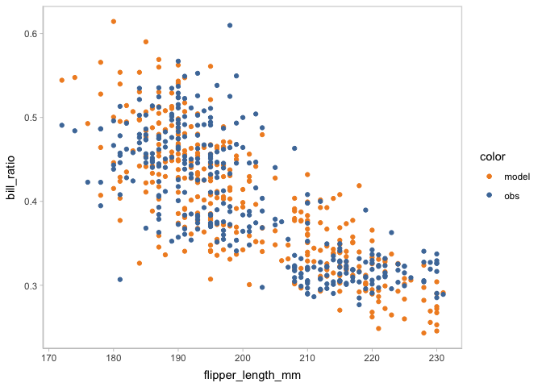

<!-- README.md is generated from README.Rmd. Please edit that file -->

# Modelcheck: An R package for generating model check visualization

<!-- badges: start -->
<!-- badges: end -->

`modelcheck` is a visualization grammar designed for model checking. It
provides users designing guidelines about model check visualizations and
allows users to create a model check visualization in a concise and
interpretable way. The structure of `modelcheck` grammar follows the
necessary components we found in model checking. First, the model
predictions or model features need to be extracted as a **distribution**
of data from model objects, i.e. data tidying. Then **uncertainty
representations** should be able to involved to describe the
distribution of model, since the uncertainty is natural inherent inside
models. The observed data must be somewhere in model checking as the
necessity of the ground truth to know the model’s performance. We don’t
want users to check the model with the observed data inside of their
mind implicitly, so there is a need to define the observed data in model
check, which deduce the need to define **comparative layouts** in model
check visualization.

## Installation

You can install the development version of modelcheck from
[GitHub](https://github.com/) with:

``` r
# install.packages("devtools")
devtools::install_github("Guoziyang27/modelcheck")
```

## Usage

### Background: model

We use a simple model to show the usage of `modelcheck`.

``` r
library(brms)
#> Loading required package: Rcpp
#> Loading 'brms' package (version 2.19.0). Useful instructions
#> can be found by typing help('brms'). A more detailed introduction
#> to the package is available through vignette('brms_overview').
#> 
#> Attaching package: 'brms'
#> The following object is masked from 'package:stats':
#> 
#>     ar
model = brm(
  bf(mpg ~ disp),
  init = "0",
  data = mtcars,
  iter = 6000,
  
  file = "models/example_model.rds" # cache model (can be removed)  
)
```

The results…

``` r
model
#>  Family: gaussian 
#>   Links: mu = identity; sigma = identity 
#> Formula: mpg ~ disp + vs + am 
#>    Data: mtcars (Number of observations: 32) 
#>   Draws: 4 chains, each with iter = 6000; warmup = 3000; thin = 1;
#>          total post-warmup draws = 12000
#> 
#> Population-Level Effects: 
#>           Estimate Est.Error l-95% CI u-95% CI Rhat Bulk_ESS Tail_ESS
#> Intercept    23.40      3.31    16.83    29.98 1.00     4998     6130
#> disp         -0.03      0.01    -0.04    -0.01 1.00     5339     6336
#> vs            3.01      1.85    -0.69     6.60 1.00     6048     7027
#> am            3.00      1.64    -0.23     6.22 1.00     6766     7410
#> 
#> Family Specific Parameters: 
#>       Estimate Est.Error l-95% CI u-95% CI Rhat Bulk_ESS Tail_ESS
#> sigma     3.25      0.46     2.51     4.27 1.00     8481     7788
#> 
#> Draws were sampled using sampling(NUTS). For each parameter, Bulk_ESS
#> and Tail_ESS are effective sample size measures, and Rhat is the potential
#> scale reduction factor on split chains (at convergence, Rhat = 1).
```

### Examples

You can create a default model check to do posterior predictive check
using only `mcplot()`.

``` r
library(modelcheck)
library(ggplot2)
library(dplyr)
#> 
#> Attaching package: 'dplyr'
#> The following objects are masked from 'package:stats':
#> 
#>     filter, lag
#> The following objects are masked from 'package:base':
#> 
#>     intersect, setdiff, setequal, union
model %>%
  mcplot()
```



To control the way to draw distribution from model, you can add a
`mc_distribution()` to `mcplot()`. Here, we are drawing the posterior
distribution of `mu` from the Gaussian model we define earlier.

``` r
model %>%
  mcplot() +
  mc_distribution("mu")
```



To add marginal effects check, you can use `mc_condition_on()` to add x
axis, row grids, and column grids.

``` r
model %>%
  mcplot() +
  mc_distribution("mu") +
  mc_condition_on(x = vars(disp))
```


Now you may find the distribution of `mpg` margining on `disp` is a
little hard to see. Then you can use `mc_model_lineribbon()` to use
line + ribbon plot to show the uncertainty of model.

``` r
model %>%
  mcplot() +
  mc_distribution("mu") +
  mc_condition_on(x = vars(disp)) +
  mc_model_lineribbon()
```



`mcplot()` puts the model predictions and data observations superposed
by default. You can change that by using `mc_layout_*()`. Here we change
the comparative layout into juxtaposition.

``` r
model %>%
  mcplot() +
  mc_distribution("mu") +
  mc_condition_on(x = vars(disp)) +
  mc_model_lineribbon() +
  mc_layout_juxtaposition()
#> Warning: Removed 16 rows containing missing values (`stat_slabinterval()`).
```


