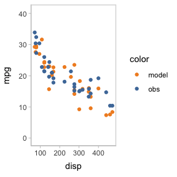
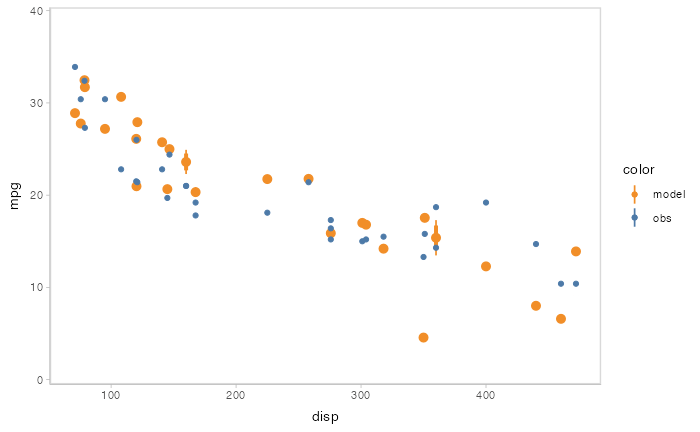

```{r, include = FALSE}
knitr::opts_chunk$set(
  collapse = TRUE,
  comment = "#>"
)
```

# Introduction

This vignette introduces the `modelcheck` package, which facilitates model check visualizations (i.e., comparing observed data to model predictions) for Bayesian models in R. This vignette follows the basic workflow in model check to show how `modelcheck` can fulfill the requirements by minimal changes in code. For more detail description on geoms and comparative layouts, see `vignette("uncert-rep")` and `vignette("comp-layout")`.

# Setup

The following libraries are required to run this vignette:

```{r setup}
library(dplyr)
library(purrr)
library(modelcheck)
library(ggplot2)
library(ggdist)
library(cowplot)
library(rstan)
library(brms)
library(gganimate)

theme_set(theme_tidybayes() + panel_border())
```

These options help Stan run faster:

```{r}
rstan_options(auto_write = TRUE)
options(mc.cores = parallel::detectCores())
```

# Model

Let’s fit a simple model on `datasets::mtcars` with default priors and four predictors:

```{r}
get_prior(bf(mpg ~ disp + carb + vs + am), data = mtcars)
```

```{r}
model = brm(
  bf(mpg ~ disp + carb + vs + am),
  init = "0",
  data = mtcars,
  iter = 6000,
  sample_prior = TRUE,
  file = "models/get-started_model.rds" # cache model (can be removed)
)
```

The results look like this:

```{r}
model
```

# Generate graphical posterior predictive checks

Now that we have the model, the model check begins: it usually starts with a density plot for posterior predictive distribution and data observed distribution. `mcplot()` here generates a density plot for model check by default if no other options defined. 

```{r}
model %>% 
  mcplot()
```

`modelcheck` puts the response variable on y axis by default. You can flip the plot to generate a canonical posterior predictive check by density plot. `modelcheck` enables you to do this by `mc_gglayer` to add a `ggplot2` layer to model check.

```{r}
model %>% 
  mcplot() +
  mc_gglayer(coord_flip())
```

`mcplot()` uses a lot of defaults to make a model check visualization when users don't explicitly define everything. The above lines are roughly equivalent to following:

```{r}
model %>% 
  mcplot() +
  mc_distribution("predictive") +
  mc_model_line(stat = "density", alpha = .1) +
  mc_obs_line(stat = "density") +
  mc_layout_superposition() +
  mc_gglayer(coord_flip())
```

`mc_distribution()` defines how `modelcheck` would draw posterior distribution, where `"predictive"` says to draw from posterior predictive distribution and `newdata = "obs"` says to use the observation dataset to generate. `mc_model_geom_line()` and `mc_obs_geom_line()` define the geom of model predictions and data observations and choose a suitable geom for users based on data types. `mc_comp_layout()` defines the comparative layout of the model check, i.e. how to compare model predictions and data observations. The option `"sup"` is for superposition, which overlaps the predictions and observations in one plot. `mc_gglayer()` adds `ggplot2::layer()` to model check visualization. We will discuss more details about these functions in later sections.

# Add conditional predictions for posterior predictive checks

Model check not only is about single variable check but also involves conditional variables and checks the response variable's marginal effects on them. For example, we want to check the impact of `disp` on `mpg` in the above model. By using `modelcheck`, it's pretty easy to do this by just adding one line code:

```{r}
model %>% 
  mcplot() +
  mc_condition_on(x = vars(disp))
```

Then you can easily apply some uncertainty representations to model predictions in `modelcheck`. For example, [lineribbon](https://mjskay.github.io/ggdist/reference/stat_lineribbon.html) and [point+interval](https://mjskay.github.io/ggdist/reference/stat_pointinterval.html) are shown below.

- Lineribbon:

```{r}
model %>% 
  mcplot() +
  mc_model_lineribbon() +
  mc_condition_on(x = vars(disp))
```

- Point + interval

```{r}
model %>% 
  mcplot() +
  mc_model_pointinterval() +
  mc_condition_on(x = vars(disp))
```

You can also show different draws by animation ([HOPs](https://medium.com/hci-design-at-uw/hypothetical-outcomes-plots-experiencing-the-uncertain-b9ea60d7c740).).

```{r}
model %>% 
  mcplot() +
  mc_model_point(draw = "hops") +
  mc_condition_on(x = vars(disp))
```

```{r echo=FALSE, results='asis'}
# animate() doesn't seem to put the images in the right place for pkgdown, so this is a manual workaround
anim_save("modelcheck-modelcheck_hops_1.gif")
cat("\n")
```

Or you can even use HOPs and other uncertainty representations together.

```{r}
model %>% 
  mcplot() +
  mc_model_pointinterval(draw = "hops") +
  mc_condition_on(x = vars(disp))
```

```{r echo=FALSE, results='asis'}
# animate() doesn't seem to put the images in the right place for pkgdown, so this is a manual workaround
anim_save("modelcheck-modelcheck_hops_2.gif")
cat("\n")
```

# Changing comparative layouts

Since model check is checking the model's performance by comparing with observed data, `modelcheck` package also enables users to change comparative layouts for model prediction and data observations through function `mc_comp_layout()`. `modelcheck` has four predefined comparative layouts: juxtaposition, superposition, nested juxtaposition, and explicit-encoding.

Juxtaposition puts the model predictions and data observations side by side. Juxtaposition is especially useful when model predictions and data observations are overlapped in superposition so they can not be distinguished well.

```{r}
model %>%
  mcplot() + 
  mc_model_eye() +
  mc_obs_eye() +
  mc_condition_on(x = vars(carb)) +
  mc_layout_juxtaposition()
```

Superposition is the default comparative layout by `modelcheck`. It puts the model predictions at the top of data observations and shows them in one plots.

```{r}
model %>%
  mcplot() + 
  mc_model_eye() +
  mc_obs_eye() +
  mc_condition_on(x = vars(carb)) +
  mc_layout_superposition()
```

When checking model conditional on a discrete variable, you might want the comparative layout neither to be superposition, since that would make data points overlapped, nor to be juxtaposition, since the visual distance between model predictions and data observations would be too large to check through. At this time, nested juxtaposition would be a good choice, which puts model predictions and data observations in one plot but does not make them overlapped.

```{r}
model %>%
  mcplot() + 
  mc_model_eye() +
  mc_obs_eye() +
  mc_condition_on(x = vars(carb)) +
  mc_layout_nested()
```

Explicit-encoding focuses on revealing the relationship between model predictions and data observations by explicitly encoding or calculating in visualizations. Some common examples could be residual plot, Q-Q plot, and wormplots. `modelcheck` supports explicitly-encoding by enabling users to pass in the operation (`exp_op`) they want to do in explicitly-encoding comparison. `modelcheck` predefines several common explicitly-encodings (e.g. residual plot and Q-Q plot) but users can still pass in a customized operation function.

Residual plot with uncertainty representation lineribbon:

```{r}
model %>%
  mcplot() + 
  mc_model_lineribbon() +
  mc_layout_encoding(transform = "residual") +
  mc_condition_on(x = vars(disp)) +
  mc_gglayer(geom_hline(yintercept = 0))
```

Q-Q plot:

```{r}
model %>%
  mcplot() + 
  mc_layout_encoding(transform = "qq") +
  mc_gglayer(geom_abline())
```

You can also cutomize the operation function to make the explicitly-encoding into any explicit comparison you want. The customized function should take an data frame including two columns for predictions and observations as input and return a data frame with columns named `y_axis` and `x_axis` (optional).


Standardized residual plot (using customized operation function):

```{r}
std_res_func = function(data) {
  data %>%
    mutate(y_axis = prediction - observation) %>%
    mutate(y_axis = y_axis / sd(y_axis))
}

model %>%
  mcplot() + 
  mc_model_lineribbon() +
  mc_layout_encoding(transform = std_res_func) +
  mc_condition_on(x = vars(disp)) +
  mc_gglayer(geom_hline(yintercept = 0))
```


